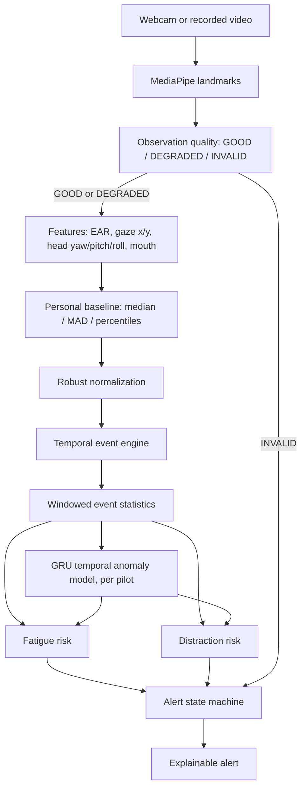

# Pilot Fatigue and Distraction Monitor

A research prototype investigating whether **personalized, temporal
behavioural modelling** improves computer-vision detection of pilot
fatigue- and distraction-related risk, compared with fixed universal
thresholds.

> **Scientific-language note:** this system estimates *fatigue- and
> distraction-related behavioural risk* from observable visual cues. It does
> not diagnose fatigue, does not measure physiological or cognitive state,
> and does not replace medical, regulatory, or crew-resource judgment. All
> outputs are labeled as behavioural-proxy risk, never as a determination of
> the pilot's internal state.

This project builds on top of the open-source
[driver-state-detection](https://github.com/e-candeloro/Driver-State-Detection)
project (MIT License) for its MediaPipe/EAR/head-pose computer-vision layer.
See `NOTICE.md` for exactly what is reused vs. newly built for this project.

## What this system does that the base project did not

| Capability | Base project | This project |
| --- | --- | --- |
| Thresholds | One fixed set for everyone | Per-pilot calibrated baseline (robust median/MAD/percentiles) |
| Signals | EAR, scalar gaze, head pose | + directional gaze, per-axis head deviation, mouth/yawn |
| Time handling | Per-signal decay timers | Explicit event engine (closure/blink/gaze/head events, each with start/duration/recovery) + a GRU-based temporal anomaly model trained on each pilot's own normal behaviour |
| Fatigue vs. distraction | Mixed into independent booleans | Two explicit, separately-scored risk pathways |
| Bad observations | Only "face missing" is distinguished | Explicit GOOD / DEGRADED / INVALID observation-quality gate |
| Alerts | Independent per-signal booleans | A hysteresis/cooldown/recovery alert state machine with an explainable reason per alert |
| Input | Webcam only | Webcam or recorded video (identical pipeline) |
| Evaluation | None | Subject-aware evaluation harness, ablation framework, 4-subject showcase |

## Architecture



Full design rationale — including the alternatives that were considered and
rejected, and why the GRU is used as a per-pilot anomaly detector trained on
normal behaviour rather than as a fatigue/distraction classifier — is written
up separately as the project's design document.

## Installation

```bash
uv sync --locked
uv run pilot-monitor-download-model
```

## Usage

**1. Calibrate a pilot** (short guided recording of normal behaviour):

```bash
uv run pilot-monitor-calibrate --pilot-id alex --camera 0 --duration 90
```

This writes `profiles/alex.json` (robust statistical baseline) and trains a
small per-pilot GRU anomaly model on the same recording, saved to
`profiles/alex_gru.pt`.

**2. Run live monitoring against that pilot's profile:**

```bash
uv run pilot-monitor --pilot-id alex --camera 0
```

**3. Or replay a recorded session** (identical pipeline, for reproducible
evaluation):

```bash
uv run pilot-monitor --pilot-id alex --video path/to/session.mp4
```

**4. Run the 4-subject showcase** (see `evaluation/README.md` — uses
synthetic-but-fully-labeled data because no real pilot video exists yet;
this is stated explicitly wherever its numbers are reported):

```bash
uv run pilot-monitor-demo
```

## Development

```bash
uv run pytest
uv run black --check pilot_monitor evaluation camera_calibration tests
uv run isort --check-only pilot_monitor evaluation camera_calibration tests
```

## License

MIT — see `LICENSE`. See `NOTICE.md` for what is derived from
`driver-state-detection` versus original to this project.
